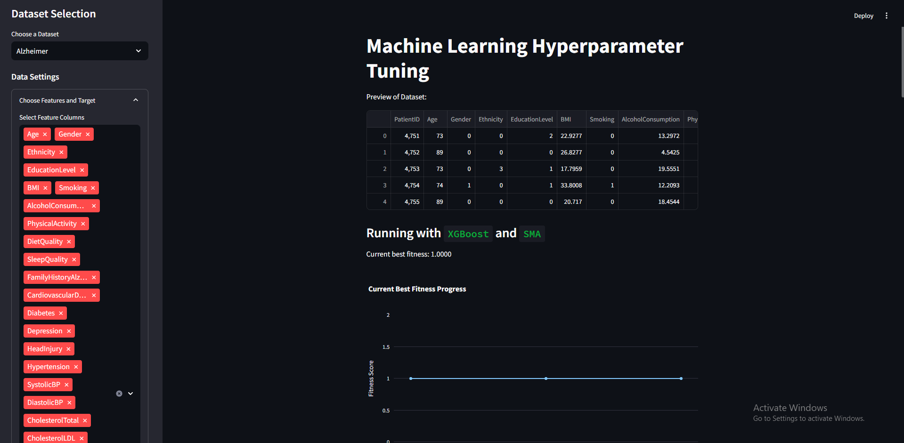
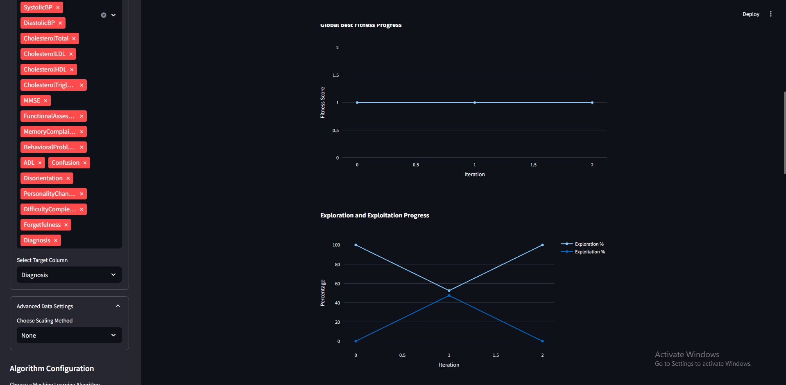
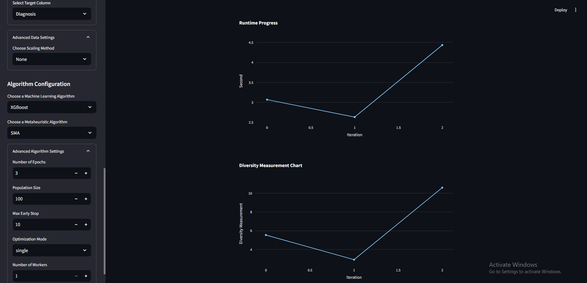
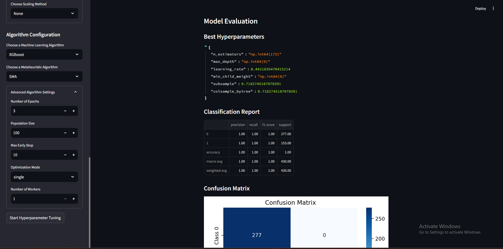
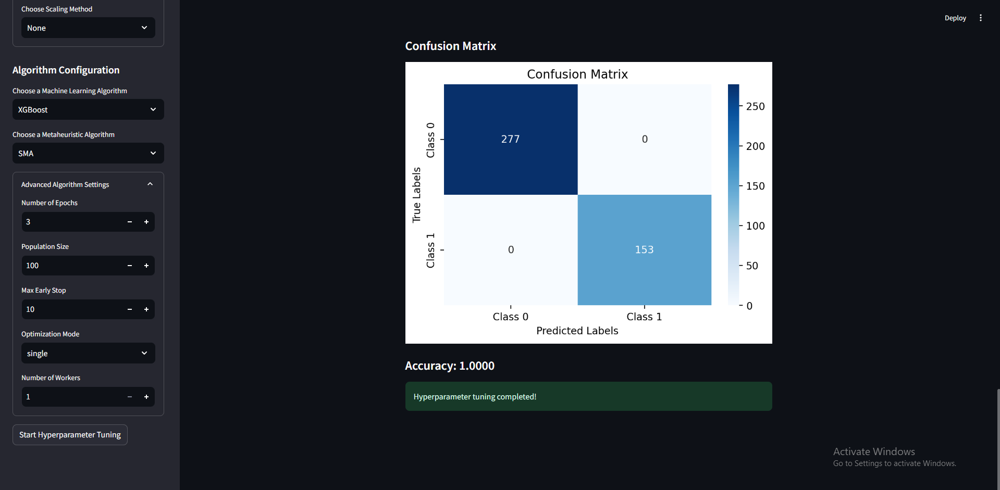
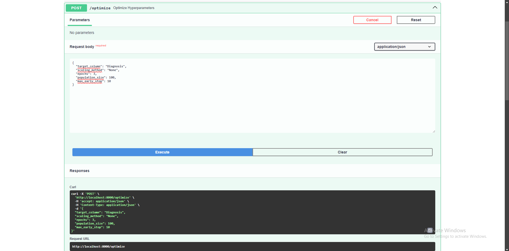
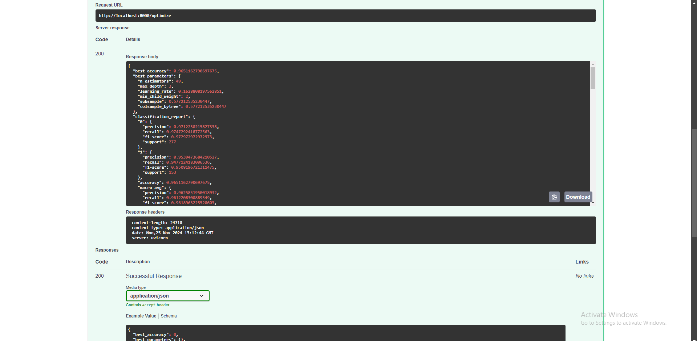

# Hyperparameter Tuning with Alzheimer Dataset

## Introduction

This project is about tuning the machine learning hyperparameter in alzheimer dataset using Metaheuristic Optimization

## How to run the code
1. Clone the repository
```bash
git clone https://github.com/KrisnaSantosa15/braincore-hyperparameter-tuning.git
```

2. Install the required libraries
```bash
pip install -r requirements.txt
```
3. Run the code
```bash
streamlit run dashboard/main.py
```

## Teaser

### Dashboard











### FastAPI



